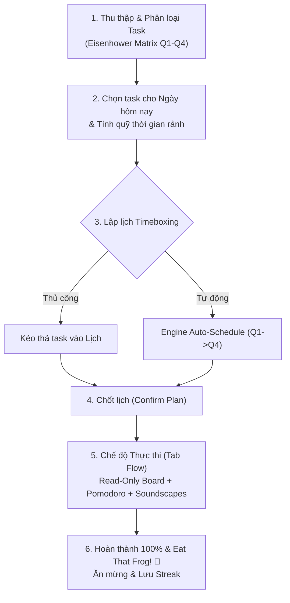

# ⏱️ My Pace — Lập kế hoạch Timeboxing & Eisenhower Matrix


**My Pace** là giải pháp quản lý thời gian cá nhân và lập kế hoạch hàng ngày thông minh, kết hợp nhuần nhuyễn hai phương pháp năng suất hàng đầu:

- 🎯 **Ma trận Eisenhower** — Phân loại công việc theo độ Khẩn cấp & Quan trọng (Q1 ➔ Q4).
- ⌛ **Timeboxing** — Chia ngày thành các khối thời gian cố định, khóa kế hoạch và thực thi tập trung cao độ.

---

## 💡 Đột phá & Tính năng cốt lõi

### 1. 📥 Backlog & Ma trận Eisenhower
- Phân loại công việc tức thì vào 4 phân khu: **Q1 (Làm ngay)**, **Q2 (Lên lịch)**, **Q3 (Ủy quyền)**, **Q4 (Loại bỏ)**.
- Hỗ trợ **Quick Add**, gán nhãn chủ đề (Categories) và lập kế hoạch theo mục tiêu (Goals).

### 2. ⚡ Union-Interval Available Time Engine
- Tự động gộp các sự kiện cố định trùng lặp (Union-Interval Algorithm) dựa trên lịch trình sinh hoạt và lịch cá nhân.
- Tính toán chính xác **Total Real Available Time** (Tổng quỹ giờ rảnh thực tế trong ngày).
- Tự động trừ **Buffer Time (20%)** để dự phòng phát sinh.
- **Cảnh báo quá tải (Overload Warning):** Cảnh báo bằng giao diện trực quan khi tổng thời gian các task được chọn vượt quá quỹ thời gian rảnh khả dụng.

### 3. 📅 Timeboxing & Smart Auto-Schedule
- **Xếp lịch thủ công (Manual Schedule):** Kéo thả task từ Backlog trực tiếp vào các khung giờ trống trên Lịch (FullCalendar v6), tùy chỉnh độ dài linh hoạt.
- **Tự động xếp lịch (Auto Schedule Engine):** Thuật toán tối ưu hóa ưu tiên phân bổ task theo thứ tự ma trận Eisenhower $Q1 \rightarrow Q2 \rightarrow Q3 \rightarrow Q4$, chia nhỏ khối thời gian tối thiểu 30 phút và bỏ qua các khoảng trống quá nhỏ.

### 4. 🚀 Execution Mode & Tab Flow (Trạng thái dòng chảy)
- **Lock Plan (Chốt lịch):** Khóa board chuyển sang chế độ **Read-Only** để ngăn chặn chỉnh sửa giữa chừng, giữ sự kiên định.
- **Tab Flow:** Chỉ hiển thị duy nhất 1 task đang diễn ra theo thời điểm thực tế, tích hợp:
  - ⏱️ **Đồng hồ Pomodoro** đếm ngược.
  - 🎧 **Soundscapes (Lofi, Sóng biển, Mưa...)** giúp tập trung tối đa.
  - 📝 **Checklist con** hỗ trợ tích chọn tiến độ tức thì.
  - 📌 **Sticky Notes** ghi chú nhanh sự cố phát sinh.
- 🎉 **Victory Celebration & Streaks:** Màn hình ăn mừng khi hoàn tất 100% công việc trong ngày, ghi nhận chuỗi ngày hoàn thành liên tục.

### 5. 🎯 Quản lý Mục tiêu 3 cấp (Goal Architecture)
- Cấu trúc chuẩn: `Milestone (Goal) ➔ Task ➔ Subtask/Checklist`.
- Theo dõi tiến độ mục tiêu trực quan dưới dạng Tree View.

---

## 🔄 Quy trình làm việc (Daily Lifecycle)



---

## 🛠️ Công nghệ sử dụng

### **Frontend (`apps/web-app`)**
- **Framework:** Next.js 16 (App Router), React 19, TypeScript
- **Styling:** Tailwind CSS v4, Radix UI / shadcn/ui components
- **State Management:** Zustand
- **Calendar & UI:** FullCalendar v6, Lucide Icons, Canvas Confetti

### **Backend (`apps/my-pace-service`)**
- **Framework:** Spring Boot 4.x, Java 21, Maven
- **Database & Cache:** PostgreSQL 16 (Spring Data JPA), Spring ConcurrentMapCache
- **Security:** JWT Authentication (`jjwt`), BCrypt
- **Mappers & Tools:** MapStruct, Lombok

### **Orchestration & DevOps**
- Docker & Docker Compose

---

## 📂 Cấu trúc dự án (Monorepo Layout)

```text
my-pace-app/
├── apps/
│   ├── web-app/                    # Frontend Application (Next.js 16)
│   │   ├── app/                    # Next.js App Router (auth, board, flow, goals, stats, calendar)
│   │   ├── components/             # Reusable UI components & layouts
│   │   ├── features/               # Feature-specific logic & states
│   │   └── hooks/                  # Custom React Hooks
│   │
│   └── my-pace-service/            # Backend Service (Spring Boot 4)
│       └── src/main/java/nhk/
│           ├── auth/               # Security, JWT, Mail OTP Authentication
│           ├── calendar/           # Calendar events & Union-Interval Available Time Engine
│           ├── goal/               # Goal & Milestone management
│           ├── scheduling/         # Reclaim Auto-Schedule Engine
│           ├── task/               # Task management & Eisenhower Matrix logic
│           └── timeblock/          # Timeboxing execution & Timeblock slots
│
├── docker-compose.yml              # Docker Compose development orchestrator
├── docker-compose.prod.yml         # Production deployment config
└── .env                            # Environmental variables
```

---

## 🚀 Hướng dẫn khởi chạy

### **Yêu cầu hệ thống:**
- [Docker](https://www.docker.com/) & Docker Compose
- Node.js 20+ & JDK 21 (nếu chạy local không qua Docker)

---

### **Cách 1: Khởi chạy nhanh bằng Docker (Khuyên dùng)**

#### 1️⃣ Khởi tạo môi trường
Tạo file `.env` cho từng dự án thành phần từ mẫu ví dụ:

```bash
# Backend .env
cp apps/my-pace-service/.env.example apps/my-pace-service/.env

# Frontend .env
cp apps/web-app/.env.example apps/web-app/.env
```

*Lưu ý:* Mở file `apps/my-pace-service/.env` và cập nhật `JWT_SECRET` (chuỗi bí mật ngẫu nhiên) cùng `RESEND_API_KEY` (nếu sử dụng tính năng gửi Email OTP).

#### 2️⃣ Khởi chạy container
```bash
docker compose up --build -d
```

#### 3️⃣ Địa chỉ truy cập
| Thành phần | URL |
|---|---|
| 🌐 **Frontend App** | [http://localhost:3000](http://localhost:3000) |
| ⚙️ **Backend API** | [http://localhost:8080](http://localhost:8080) |
| 🗄️ **PostgreSQL** | `localhost:5432` |
| 🔴 **Redis** | `localhost:6379` |

#### 🛑 Dừng hệ thống
```bash
docker compose down
```

---

### **Cách 2: Khởi chạy Local Development (Không qua Docker)**

#### 1️⃣ Chạy Database & Redis bằng Docker Compose
```bash
docker compose up postgres redis -d
```

#### 2️⃣ Chạy Backend Service (Spring Boot)
```bash
cd apps/my-pace-service
./mvnw spring-boot:run
```

#### 3️⃣ Chạy Frontend Service (Next.js)
```bash
cd apps/web-app
npm install
npm run dev
```

---

## 🔑 Biến môi trường quan trọng

### Backend (`apps/my-pace-service/.env`)
```env
SPRING_DATASOURCE_URL=jdbc:postgresql://localhost:5432/mypacedb
SPRING_DATASOURCE_USERNAME=mypace
SPRING_DATASOURCE_PASSWORD=mypace_secret
SPRING_REDIS_HOST=localhost
SPRING_REDIS_PORT=6379
JWT_SECRET=your_super_secret_jwt_key_at_least_256_bits_long
RESEND_API_KEY=re_123456789
```

### Frontend (`apps/web-app/.env`)
```env
NEXT_PUBLIC_API_URL=http://localhost:8080
```

---

## 📝 Quy chuẩn đóng góp & Clean Code

- **Frontend Atomic Design:** Tuân thủ Single Responsibility Principle. Mỗi item trong danh sách hoặc form inline được tách riêng thành sub-component bên dưới `components/`.
- **Backend Architecture:** Controller mỏng, xử lý nghiệp vụ tập trung tại Service Layer. Sử dụng MapStruct cho DTO mapping và UUID cho toàn bộ Identifier.
- **Timezone Safety:** Mọi tính toán mốc thời gian đều được bảo toàn theo Timezone người dùng (`ZoneId`).

---

## 📄 License & Tác giả

Dự án được phát triển bởi **Nguyen Hoang** và cộng đồng đóng góp.  
Bản quyền © 2026 **My Pace**. Bảo lưu mọi quyền.