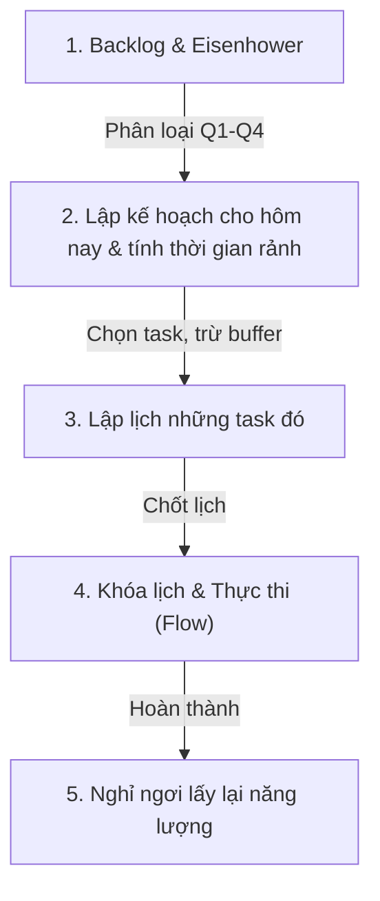

# My Pace — Lập kế hoạch Timeboxing & Eisenhower

**My Pace** là ứng dụng lập kế hoạch hàng ngày và quản lý thời gian cá nhân, kết hợp hai phương pháp:

- **Timeboxing** — chia ngày thành các khối thời gian cố định.
- **Ma trận Eisenhower** — phân loại công việc theo mức độ khẩn cấp/quan trọng.

Mục tiêu: giúp người dùng lên lịch khoa học, tập trung cao độ và giảm trì hoãn.

Dự án tổ chức dạng **Monorepo**, gồm Frontend (Next.js) và Backend (Spring Boot), khởi chạy nhanh bằng Docker Compose.

---

## 🔄 Quy trình sử dụng (4 bước)



### Bước 1 — Backlog & Ma trận Eisenhower
Người dùng nhập nhanh mọi công việc phát sinh vào Backlog để giải phóng bộ nhớ, gom hết việc về một nơi. Mỗi task được phân vào 1 trong 4 ô, dựa trên mức khẩn cấp/quan trọng:

| Ô | Ý nghĩa | Hành động |
|---|---|---|
| **Q1 — Do First** | Khẩn cấp & quan trọng | Làm ngay |
| **Q2 — Schedule** | Quan trọng, chưa khẩn cấp | Lên kế hoạch |
| **Q3 — Delegate** | Khẩn cấp, không quan trọng | Ủy quyền / xử lý nhanh |
| **Q4 — Eliminate** | Không khẩn cấp, không quan trọng | Hạn chế làm |

### Bước 2 — Lập kế hoạch & tính thời gian rảnh
Người dùng chọn các task từ ma trận Eisenhower để đưa vào kế hoạch hôm nay (hoặc chuẩn bị cho ngày mai).

- Backend dùng **Union-Interval Engine** để gộp các khoảng thời gian cố định (lịch họp, lịch học...) và tính ra **Total Real Available Time** — tổng thời gian rảnh thực tế, dựa trên giờ thức dậy/đi ngủ và các sự kiện cố định.
- Giao diện hiển thị **Remaining Available Time** = thời gian rảnh − buffer time (mặc định 20%) − các task đã chọn.
- **Cảnh báo quá tải:** nếu tổng thời gian task chọn vượt quỹ rảnh, số giờ chuyển màu đỏ âm (vd. `-1h 15m`) và thanh tiến trình nhấp nháy để cảnh báo đang lạm vào buffer time.

### Bước 3 — Xếp lịch (Timeboxing)
Sau khi chọn xong danh sách việc, người dùng bấm "Bắt đầu ngày mới" và chọn 1 trong 2 cách xếp lịch:

- **Manual Schedule** — kéo thả từng task từ danh sách chờ vào khung giờ trống trên Lịch; có thể kéo giãn để tự cập nhật `estimatedMinutes`.
- **Auto Schedule** — engine tự động phân bổ toàn bộ task vào khung giờ trống tối ưu, ưu tiên việc quan trọng trước.

Khi danh sách chờ đã xếp hết, nút **Chốt lịch (Confirm Plan)** xuất hiện để khóa kế hoạch và chính thức bắt đầu ngày.

### Bước 4 — Khóa lịch & Thực thi (Execution Mode / Flow)
Sau khi chốt lịch:

- Lịch và Board chuyển sang **chỉ đọc (Read-Only)** để tránh chỉnh sửa giữa chừng gây xao nhãng.
- Người dùng chuyển qua tab **Flow**, chỉ thấy đúng một task đang diễn ra theo lịch trình.
- Dùng đồng hồ Pomodoro kèm Soundscapes (Lofi, sóng biển...) để tập trung; mỗi task lớn có thể có checklist con để chia nhỏ công việc.
- Hoàn thành task cuối cùng trong ngày → màn hình **ăn mừng chiến thắng**, ghi nhận streak để tạo động lực duy trì.

---

## 🏗️ Cấu trúc thư mục

```text
my-pace-app/
├── apps/
│   ├── web-app/            # Frontend: Next.js 16, React 19, Zustand, Tailwind v4
│   └── my-pace-service/    # Backend: Spring Boot 4.x, Java 21, PostgreSQL, Redis
├── docker-compose.yml      # Khởi chạy toàn bộ database và ứng dụng
└── .env.example             # Mẫu biến môi trường cho từng ứng dụng
```

---

## 💻 Khởi chạy dự án (Docker)

**Yêu cầu:** đã cài **Docker** và **Docker Compose**.

### 1. Cấu hình biến môi trường

**Backend** (`apps/my-pace-service`):
```bash
cp apps/my-pace-service/.env.example apps/my-pace-service/.env
```
Điền `JWT_SECRET` (chuỗi ngẫu nhiên tối thiểu 256-bit) và `RESEND_API_KEY` (dùng gửi OTP qua email).

**Frontend** (`apps/web-app`):
```bash
cp apps/web-app/.env.example apps/web-app/.env
```

### 2. Khởi chạy hệ thống
```bash
docker compose up --build -d
```
Docker sẽ tự tải image nền, build Frontend/Backend và khởi chạy toàn bộ dịch vụ (Database, Redis, API, Web).

### 3. Truy cập ứng dụng
| Dịch vụ | URL |
|---|---|
| Frontend | http://localhost:3000 |
| Backend API | http://localhost:8080 |

### Dừng hệ thống
```bash
docker compose down
```